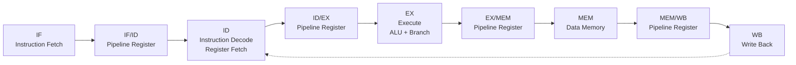
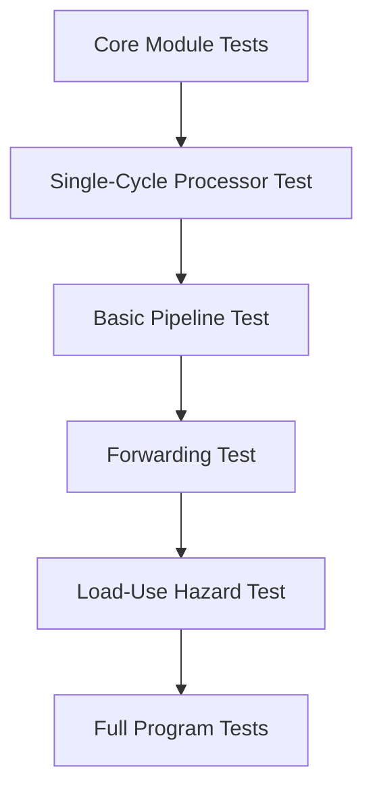

<div align="center">

# 5-stage Pipelined RV32I RISC-V Processor

<br>


<br>

</div>

---

## About the Project

This project is a Verilog implementation of an **5-stage pipelined RV32I RISC-V processor** featuring both a **single-cycle processor** and a **5-stage pipelined processor**.

The pipelined processor is organized into separate IF, ID, EX, MEM, and WB stages with dedicated inter-stage pipeline registers. It supports forwarding, load-use hazard stalling, branch/jump flushing, ALU control, register file operations, and instruction/data memory access.

The design is verified using module-level testbenches, processor-level tests, hazard-specific tests, and complete .mem program simulations.

---

## Architecture



The processor is organized around the classic RISC pipeline.

| Stage   | Role                                                                                     |
| ------- | ---------------------------------------------------------------------------------------- |
| **IF**  | Fetches instruction from instruction memory and computes the next PC                     |
| **ID**  | Decodes instruction, reads registers, generates immediates and control signals           |
| **EX**  | Performs ALU operations, branch comparison, target calculation, and forwarding selection |
| **MEM** | Handles load and store operations through data memory                                    |
| **WB**  | Writes ALU result, memory data, or return address back to the register file              |

---

## What This Processor Supports

| Category          | Instructions                      |
| ----------------- | --------------------------------- |
| **Arithmetic**    | `ADD`, `SUB`, `ADDI`              |
| **Logical**       | `AND`, `OR`, `XOR`, `ANDI`, `ORI` |
| **Comparison**    | `SLT`                             |
| **Memory**        | `LW`, `SW`                        |
| **Branch / Jump** | `BEQ`, `BNE`, `JAL`               |

---

## Core Capabilities

| Feature                            | Status   |
| ---------------------------------- | -------- |
| Single-cycle RV32I processor       | Complete |
| 5-stage pipelined datapath         | Complete |
| Modular IF, ID, EX, MEM, WB stages | Complete |
| Pipeline registers                 | Complete |
| Register file with hardwired `x0`  | Complete |
| RV32I immediate generation         | Complete |
| ALU and ALU control                | Complete |
| Instruction memory and data memory | Complete |
| Data forwarding                    | Complete |
| Load-use hazard stall              | Complete |
| Branch and jump flush              | Complete |
| Program-level verification         | Complete |

---

## Pipeline Hazard Handling

A pipelined processor must handle cases where instructions overlap and depend on each other. This design includes both **forwarding** and **stalling** mechanisms.

### Data Forwarding

Forwarding is used when an instruction needs a value that has already been computed by an older instruction but has not yet reached the register file.

```text
EX/MEM  →  EX
MEM/WB  →  EX
WB      →  ID
```

This allows back-to-back dependent arithmetic instructions to execute correctly without unnecessary stalls.

### Load-Use Hazard Stall

A load-use hazard occurs when an instruction immediately after `LW` depends on the loaded data.

```asm
lw   x1, 0(x2)
add  x3, x1, x4
```

Since load data becomes available only after the memory stage, the processor inserts one bubble by holding the PC and IF/ID register while flushing the ID/EX control signals.

### Branch and Jump Flush

For `BEQ`, `BNE`, and `JAL`, the processor flushes wrong-path instructions after a taken branch or jump. This prevents incorrectly fetched instructions from updating architectural state.

---

## Repository Structure

```text
Pipelined-RV32I-RISC-V-Processor/
│
├── programs/
│   ├── array_sum.mem
│   ├── fibonacci.mem
│   ├── forwarding_stress.mem
│   ├── gcd_subtraction.mem
│   └── max_array.mem
│
├── rtl/
│   │
│   ├── core/
│   │   ├── adder.v
│   │   ├── alu.v
│   │   ├── alu_control.v
│   │   ├── control_unit.v
│   │   ├── data_memory.v
│   │   ├── imm_gen.v
│   │   ├── instruction_memory.v
│   │   ├── mux2_32.v
│   │   ├── mux3_32.v
│   │   ├── program_counter.v
│   │   ├── register_file.v
│   │   └── single_cycled_top.v
│   │
│   └── pipeline/
│       ├── pipelined_top.v
│       │
│       ├── stages/
│       │   ├── if_stage.v
│       │   ├── id_stage.v
│       │   ├── ex_stage.v
│       │   ├── mem_stage.v
│       │   └── wb_stage.v
│       │
│       ├── registers/
│       │   ├── if_id.v
│       │   ├── id_ex.v
│       │   ├── ex_mem.v
│       │   └── mem_wb.v
│       │
│       └── hazard/
│           ├── forwarding_unit.v
│           └── load_use_hazard_unit.v
│
├── tb/
│   │
│   ├── core/
│   │   ├── alu_tb.v
│   │   ├── control_unit_tb.v
│   │   ├── data_memory_tb.v
│   │   ├── imm_gen_tb.v
│   │   ├── instruction_memory_tb.v
│   │   ├── pipelined_top_tb.v
│   │   ├── pipelined_top_forwarding_tb.v
│   │   ├── pipelined_top_load_use_hazard_tb.v
│   │   ├── program_counter_tb.v
│   │   ├── register_file_tb.v
│   │   └── single_cycle_top_tb.v
│   │
│   └── programs/
│       ├── array_sum_tb.v
│       ├── fibonacci_pipelined_tb.v
│       ├── fibonacci_single_cycled_tb.v
│       ├── forwarding_stress_tb.v
│       ├── gcd_subtraction_tb.v
│       └── max_array_tb.v
│
├── sim/
│   └── scripts/
│       ├── run_array_sum.sh
│       ├── run_fibonacci.sh
│       ├── run_forwarding_stress.sh
│       ├── run_gcd_subtraction.sh
│       └── run_max_array.sh
│
├── .gitignore
└── README.md
```

---

## RTL Organization

The RTL is divided into reusable core blocks and pipelined processor blocks.

| Folder                         | Description                                               |
| ------------------------------ | --------------------------------------------------------- |
| `rtl/core/`                    | Common datapath and control modules used by the processor |
| `rtl/pipeline/stages/`         | The five pipeline stage modules                           |
| `rtl/pipeline/registers/`      | IF/ID, ID/EX, EX/MEM, and MEM/WB pipeline registers       |
| `rtl/pipeline/hazard/`         | Forwarding and load-use hazard detection units            |
| `rtl/pipeline/pipelined_top.v` | Top-level pipelined processor integration                 |

This keeps the design modular and easy to debug. Each stage is separated, while the top module connects the full datapath, control path, hazard units, and pipeline registers.

---

## Verification

The project is verified at both block level and processor level.



| Verification Area | Test Coverage                                                                          |
| ----------------- | -------------------------------------------------------------------------------------- |
| Core modules      | ALU, control unit, register file, immediate generator, instruction memory, data memory |
| Single-cycle CPU  | End-to-end instruction execution before pipelining                                     |
| Pipelined CPU     | Stage connection, register propagation, PC update, write-back correctness              |
| Forwarding        | Back-to-back RAW dependencies                                                          |
| Load-use hazard   | Stall and bubble insertion after `LW`                                                  |
| Program execution | Complete `.mem` programs running on the pipelined processor                            |

---

## Program Tests

| Program                 | What it verifies                                          |
| ----------------------- | --------------------------------------------------------- |
| `fibonacci.mem`         | Loop execution, arithmetic, memory access, branch control |
| `array_sum.mem`         | Array traversal, repeated loads, accumulation             |
| `gcd_subtraction.mem`   | Branch-heavy loop execution                               |
| `max_array.mem`         | Comparisons, memory reads, conditional updates            |
| `forwarding_stress.mem` | Back-to-back dependencies and forwarding paths            |

---

## Running the Project

### Requirements

| Tool           | Purpose                             |
| -------------- | ----------------------------------- |
| Icarus Verilog | Compile and run Verilog simulations |
| GTKWave        | View generated VCD waveforms        |
| Bash           | Run simulation scripts              |

Install on Ubuntu or WSL:

```bash
sudo apt update
sudo apt install iverilog gtkwave
```

Clone the repository:

```bash
git clone https://github.com/Maanas-Khatokar-N/Pipelined-RV32I-RISC-V-Processor.git
cd Pipelined-RV32I-RISC-V-Processor
```

Run any program test using the scripts inside `sim/scripts`.

```bash
chmod +x sim/scripts/*.sh
```

| Test               | Command                                  |
| ------------------ | ---------------------------------------- |
| Fibonacci          | `./sim/scripts/run_fibonacci.sh`         |
| Array Sum          | `./sim/scripts/run_array_sum.sh`         |
| GCD by Subtraction | `./sim/scripts/run_gcd_subtraction.sh`   |
| Maximum in Array   | `./sim/scripts/run_max_array.sh`         |
| Forwarding Stress  | `./sim/scripts/run_forwarding_stress.sh` |

Each script compiles the RTL, runs the corresponding testbench, and prints the verification result in the terminal.

---

## Memory Model

The processor uses separate instruction and data memories.

| Memory             | Usage                                                         |
| ------------------ | ------------------------------------------------------------- |
| Instruction Memory | Stores 32-bit instructions loaded from `.mem` files           |
| Data Memory        | Stores 32-bit data values used by load and store instructions |

Data memory is word-indexed internally using:

```verilog
memory[addr[31:2]]
```

So a byte address maps to a word location as follows:

```text
Address 40  -> memory[10]
Address 100 -> memory[25]
Address 104 -> memory[26]
```

This is useful while writing program testbenches and checking final memory outputs.

---

## Design Snapshot

```text
ISA              : RV32I subset
Data width       : 32-bit
Register file    : 32 × 32-bit
Register x0      : Hardwired to zero
Pipeline stages  : IF, ID, EX, MEM, WB
Memory model     : Separate instruction and data memory
Hazards handled  : Forwarding, load-use stall, branch/jump flush
Verification     : Unit tests + full program simulations
```

---

## Future Improvements

| Improvement                      | Purpose                                      |
| -------------------------------- | -------------------------------------------- |
| Add remaining RV32I instructions | Increase ISA completeness                    |
| Add `JALR` support               | Improve control-flow capability              |
| Add shift instructions           | Support more arithmetic/logical programs     |
| Add automated regression script  | Run all tests with one command               |
| Add waveform screenshots         | Make debugging and documentation more visual |

---

<div align="center">

### Built to see how every instruction moves through the pipeline, one clock cycle at a time.

</div>
