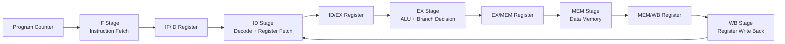
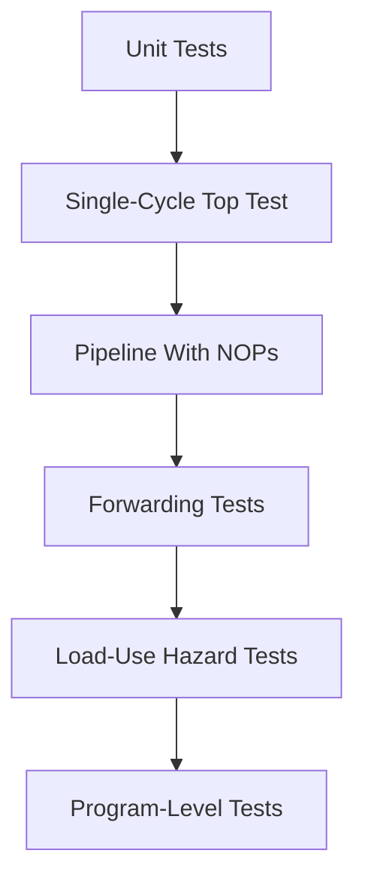

<div align="center">

# 5-Stage Pipelined RV32I RISC-V Processor

### A modular Verilog implementation of a 32-bit RV32I processor with pipelined execution, forwarding, hazard handling, and program-level simulation.

<br>


</div>

---

## Overview

This project implements a **5-stage pipelined RV32I RISC-V processor** in Verilog.

The processor started as a single-cycle RV32I design and was then extended into a modular pipelined architecture. It supports a practical subset of the RV32I base integer instruction set and includes pipeline registers, instruction/data memories, ALU/control logic, forwarding logic, branch/jump flushing, and load-use hazard handling.

The design is intended for learning and demonstrating core computer architecture concepts such as:

* RV32I instruction decoding
* Single-cycle processor design
* 5-stage pipelining
* Inter-stage pipeline registers
* Data hazards
* Forwarding/bypassing
* Load-use stalls
* Control hazard flushing
* Program-level verification using Verilog testbenches

---

## Processor Architecture

The processor follows the classic 5-stage RISC pipeline:

```text
Instruction Fetch  ->  Instruction Decode  ->  Execute  ->  Memory  ->  Write Back
       IF                     ID                 EX          MEM          WB
```



### Pipeline Stages

| Stage | Name               | Main Function                                                                                   |
| ----- | ------------------ | ----------------------------------------------------------------------------------------------- |
| IF    | Instruction Fetch  | Fetches instruction from instruction memory and computes `PC + 4`                               |
| ID    | Instruction Decode | Decodes instruction, reads register file, generates immediate and control signals               |
| EX    | Execute            | Performs ALU operation, branch comparison, target address calculation, and forwarding selection |
| MEM   | Memory Access      | Performs load/store operations using data memory                                                |
| WB    | Write Back         | Writes ALU result, memory data, or `PC + 4` back to the register file                           |

---

## Features

* 32-bit RV32I-style processor datapath
* 5-stage pipelined implementation
* Modular stage-based RTL design
* Separate instruction and data memories
* Register file with 32 general-purpose registers
* `x0` hardwired to zero
* ALU support for arithmetic, logical, and comparison operations
* Control unit for RV32I instruction decoding
* Immediate generator for multiple instruction formats
* Pipeline registers:

  * `IF/ID`
  * `ID/EX`
  * `EX/MEM`
  * `MEM/WB`
* Forwarding unit for resolving common RAW data hazards
* Load-use hazard detection with stall and bubble insertion
* Branch and jump flush support
* Self-checking Verilog testbenches
* Program-level `.mem` file loading
* VCD waveform generation for GTKWave

---

## Supported Instruction Subset

This project currently supports a focused RV32I subset suitable for demonstrating pipelined execution and hazards.

| Type   | Instructions                            |
| ------ | --------------------------------------- |
| R-Type | `ADD`, `SUB`, `AND`, `OR`, `XOR`, `SLT` |
| I-Type | `ADDI`, `ORI`, `ANDI`, `LW`             |
| S-Type | `SW`                                    |
| B-Type | `BEQ`, `BNE`                            |
| J-Type | `JAL`                                   |

### Instruction Categories

```text
Arithmetic      : ADD, SUB, ADDI
Logical         : AND, OR, XOR, ANDI, ORI
Comparison      : SLT
Memory Access   : LW, SW
Control Flow    : BEQ, BNE, JAL
```

---

## Repository Structure

```text
Pipelined-RV32I-RISC-V-Processor/
│
├── README.md
├── .gitignore
│
├── docs/
│   ├── architecture.md
│   ├── instruction_set.md
│   ├── pipeline_design.md
│   ├── hazard_forwarding.md
│   ├── verification.md
│   └── images/
│       ├── datapath.png
│       ├── pipeline_diagram.png
│       └── waveform_examples/
│
├── programs/
│   ├── fibonacci_pipelined.mem
│   ├── array_sum.mem
│   ├── gcd_subtraction.mem
│   ├── max_array.mem
│   └── forwarding_stress.mem
│
├── rtl/
│   │
│   ├── core/
│   │   ├── adder.v
│   │   ├── alu.v
│   │   ├── alu_control.v
│   │   ├── control_unit.v
│   │   ├── data_memory.v
│   │   ├── imm_gen.v
│   │   ├── instruction_memory.v
│   │   ├── mux2_32.v
│   │   ├── mux3_32.v
│   │   ├── program_counter.v
│   │   ├── register_file.v
│   │   └── single_cycled_top.v
│   │
│   └── pipeline/
│       ├── pipelined_top.v
│       │
│       ├── stages/
│       │   ├── if_stage.v
│       │   ├── id_stage.v
│       │   ├── ex_stage.v
│       │   ├── mem_stage.v
│       │   └── wb_stage.v
│       │
│       ├── registers/
│       │   ├── if_id.v
│       │   ├── id_ex.v
│       │   ├── ex_mem.v
│       │   └── mem_wb.v
│       │
│       └── hazard/
│           ├── forwarding_unit.v
│           └── load_use_hazard_unit.v
│
├── tb/
│   ├── alu_tb.v
│   ├── control_unit_tb.v
│   ├── data_memory_tb.v
│   ├── imm_gen_tb.v
│   ├── instruction_memory_tb.v
│   ├── register_file_tb.v
│   ├── single_cycled_top_tb.v
│   └── programs/
│       ├── fibonacci_pipelined_tb.v
│       ├── array_sum_tb.v
│       ├── gcd_subtraction_tb.v
│       ├── max_array_tb.v
│       └── forwarding_stress_tb.v
│
└── sim/
    ├── scripts/
    │   ├── run_fibonacci.sh
    │   ├── run_array_sum.sh
    │   ├── run_gcd_subtraction.sh
    │   ├── run_max_array.sh
    │   └── run_forwarding_stress.sh
    │
    ├── build/
    └── waveforms/
```

> `sim/build/` and `sim/waveforms/` are generated during simulation and should remain ignored by Git.

---

## Documentation

The main README gives a high-level view of the project. Detailed design explanations should be placed inside the `docs/` folder.

| Document                    | Purpose                                                                 |
| --------------------------- | ----------------------------------------------------------------------- |
| `docs/architecture.md`      | Overall processor architecture and top-level datapath                   |
| `docs/instruction_set.md`   | Supported RV32I subset, instruction formats, opcode/funct mapping       |
| `docs/pipeline_design.md`   | Explanation of IF, ID, EX, MEM, WB stages and pipeline registers        |
| `docs/hazard_forwarding.md` | Forwarding paths, load-use stall logic, branch/jump flushing            |
| `docs/verification.md`      | Testbench strategy, program tests, expected outputs, waveform debugging |
| `docs/images/`              | Datapath diagrams, pipeline diagrams, screenshots, and waveform images  |

Keeping detailed explanations in `docs/` keeps the main README clean and professional.

---

## Datapath Summary

### Core Components

| Module                   | Description                                                        |
| ------------------------ | ------------------------------------------------------------------ |
| `program_counter.v`      | Holds the current instruction address                              |
| `instruction_memory.v`   | Stores program instructions loaded from `.mem` files               |
| `register_file.v`        | 32-register file with two read ports and one write port            |
| `imm_gen.v`              | Generates sign-extended immediates                                 |
| `control_unit.v`         | Generates main control signals from opcode                         |
| `alu_control.v`          | Generates ALU control signal using `ALUOp`, `funct3`, and `funct7` |
| `alu.v`                  | Performs arithmetic, logical, and comparison operations            |
| `data_memory.v`          | Handles word-level load and store operations                       |
| `mux2_32.v`, `mux3_32.v` | Datapath selection multiplexers                                    |

### Pipeline Components

| Module                   | Description                                            |
| ------------------------ | ------------------------------------------------------ |
| `if_stage.v`             | Fetches instruction and updates PC                     |
| `id_stage.v`             | Decodes instruction and reads register operands        |
| `ex_stage.v`             | Executes ALU operation and computes branch/jump target |
| `mem_stage.v`            | Accesses data memory                                   |
| `wb_stage.v`             | Selects final write-back data                          |
| `if_id.v`                | Pipeline register between IF and ID                    |
| `id_ex.v`                | Pipeline register between ID and EX                    |
| `ex_mem.v`               | Pipeline register between EX and MEM                   |
| `mem_wb.v`               | Pipeline register between MEM and WB                   |
| `forwarding_unit.v`      | Resolves ALU-to-ALU RAW hazards                        |
| `load_use_hazard_unit.v` | Detects load-use hazards and inserts one-cycle stall   |

---

## Hazard Handling

Pipelined processors can produce incorrect results when instructions depend on values that have not yet reached the write-back stage. This design handles the important pipeline hazards needed for the supported instruction subset.

### 1. Data Forwarding

Forwarding is used when an instruction in the EX stage needs a result that is already computed by an older instruction but has not yet been written back to the register file.

Supported forwarding paths:

```text
EX/MEM  ->  EX
MEM/WB  ->  EX
```

Example:

```asm
addi x1, x0, 10
addi x2, x1, 20
add  x3, x2, x1
```

Without forwarding, `x2` or `x1` may be read before the correct updated value is written back. The forwarding unit selects the latest available value and sends it directly to the ALU input.

### 2. Load-Use Hazard Stall

A load-use hazard occurs when an instruction immediately after a `lw` depends on the loaded value.

Example:

```asm
lw   x1, 0(x2)
add  x3, x1, x4
```

The loaded data becomes available only after the MEM stage, so forwarding alone is not enough. The hazard unit inserts one bubble by:

```text
PC hold       -> stop fetching new instruction
IF/ID hold    -> keep same instruction in decode
ID/EX flush   -> insert bubble into execute stage
```

### 3. Branch and Jump Flush

For control-flow instructions like `beq`, `bne`, and `jal`, wrong-path instructions may already enter the pipeline before the branch/jump decision is known.

This design flushes the required pipeline registers when a branch or jump is taken.

---

## Memory Model

The processor uses separate instruction and data memories.

| Memory             | Description                |
| ------------------ | -------------------------- |
| Instruction Memory | Stores 32-bit instructions |
| Data Memory        | Stores 32-bit data words   |

The data memory is word-addressed internally using:

```verilog
memory[addr[31:2]]
```

So byte addresses map to word indices as follows:

```text
Byte address 40  -> memory[10]
Byte address 44  -> memory[11]
Byte address 100 -> memory[25]
```

This is important while writing testbenches and checking memory outputs.

---

## Example Programs

Program-level tests are used to verify the pipelined processor beyond simple unit testing.

| Program                   | Purpose                                                        |
| ------------------------- | -------------------------------------------------------------- |
| `fibonacci_pipelined.mem` | Tests loops, load/store, branches, arithmetic, and write-back  |
| `array_sum.mem`           | Tests memory traversal and repeated accumulation               |
| `gcd_subtraction.mem`     | Tests loop-heavy branch behavior                               |
| `max_array.mem`           | Tests comparisons, branches, and array memory access           |
| `forwarding_stress.mem`   | Tests back-to-back dependent instructions and forwarding paths |

---

## Testbenches

The project contains both module-level and processor-level testbenches.

### Unit-Level Testbenches

| Testbench                 | Verifies                                      |
| ------------------------- | --------------------------------------------- |
| `alu_tb.v`                | ALU operations                                |
| `control_unit_tb.v`       | Opcode decoding and control signal generation |
| `data_memory_tb.v`        | Load/store behavior                           |
| `imm_gen_tb.v`            | Immediate generation                          |
| `instruction_memory_tb.v` | Instruction fetch behavior                    |
| `register_file_tb.v`      | Register read/write behavior                  |

### Processor-Level Testbenches

| Testbench                  | Verifies                                         |
| -------------------------- | ------------------------------------------------ |
| `single_cycled_top_tb.v`   | Single-cycle processor integration               |
| `fibonacci_pipelined_tb.v` | Full pipelined processor using Fibonacci program |
| `array_sum_tb.v`           | Array summation program                          |
| `gcd_subtraction_tb.v`     | GCD using repeated subtraction                   |
| `max_array_tb.v`           | Maximum element search                           |
| `forwarding_stress_tb.v`   | Forwarding and dependency stress cases           |

---

## Requirements

Install the following tools:

* Icarus Verilog
* GTKWave
* Git

### Ubuntu / Debian

```bash
sudo apt update
sudo apt install iverilog gtkwave git
```

### Windows

Recommended options:

* Use Icarus Verilog for Windows
* Use GTKWave for waveform viewing
* Or run the project inside WSL

---

## Running Simulations

Clone the repository:

```bash
git clone https://github.com/Maanas-Khatokar-N/Pipelined-RV32I-RISC-V-Processor.git
cd Pipelined-RV32I-RISC-V-Processor
```

Create simulation folders:

```bash
mkdir -p sim/build
mkdir -p sim/waveforms
```

---

## Run Using Scripts

The recommended way is to use scripts from `sim/scripts/`.

### Fibonacci Test

```bash
chmod +x sim/scripts/run_fibonacci.sh
./sim/scripts/run_fibonacci.sh
```

### Other Program Tests

```bash
./sim/scripts/run_array_sum.sh
./sim/scripts/run_gcd_subtraction.sh
./sim/scripts/run_max_array.sh
./sim/scripts/run_forwarding_stress.sh
```

Each script should:

1. Create build and waveform folders
2. Compile all required RTL files
3. Compile the selected testbench
4. Run the simulation
5. Generate a `.vcd` waveform file

---

## Manual Compilation

To run any testbench manually:

```bash
iverilog -Wall -o sim/build/<test_name>.vvp \
rtl/core/*.v \
rtl/pipeline/hazard/*.v \
rtl/pipeline/registers/*.v \
rtl/pipeline/stages/*.v \
rtl/pipeline/*.v \
tb/programs/<testbench_name>.v
```

Run the simulation:

```bash
vvp sim/build/<test_name>.vvp
```

Open waveform:

```bash
gtkwave sim/waveforms/<waveform_name>.vcd
```

Example:

```bash
iverilog -Wall -o sim/build/fibonacci.vvp \
rtl/core/*.v \
rtl/pipeline/hazard/*.v \
rtl/pipeline/registers/*.v \
rtl/pipeline/stages/*.v \
rtl/pipeline/*.v \
tb/programs/fibonacci_pipelined_tb.v

vvp sim/build/fibonacci.vvp
gtkwave sim/waveforms/pipelined_fibonacci_tb.vcd
```

---

## Loading a Custom Program

To run your own `.mem` program:

1. Add the program file inside `programs/`

```text
programs/my_program.mem
```

2. Create or edit a testbench and load it using:

```verilog
$readmemh("programs/my_program.mem", dut.IF.inst_mem.memory);
```

3. Initialize any required data memory values:

```verilog
dut.MEM.dm.memory[10] = 32'd7;
```

4. Compile with the same RTL files:

```bash
iverilog -Wall -o sim/build/my_program.vvp \
rtl/core/*.v \
rtl/pipeline/hazard/*.v \
rtl/pipeline/registers/*.v \
rtl/pipeline/stages/*.v \
rtl/pipeline/*.v \
tb/programs/my_program_tb.v
```

5. Run:

```bash
vvp sim/build/my_program.vvp
```

---

## Example: Fibonacci Program

The Fibonacci test loads a program into instruction memory and places the input value in data memory.

Example setup:

```verilog
$readmemh("programs/fibonacci_pipelined.mem", dut.IF.inst_mem.memory);

dut.MEM.dm.memory[10] = 32'd7;   // input N = 7
```

Since data memory uses `addr[31:2]`:

```text
address 40 -> memory[10]
address 44 -> memory[11]
```

Expected output for `N = 7`:

```text
Fib(7) = 13
```

---

## Verification Strategy

The processor is verified in multiple levels.



### Verification Levels

| Level                      | Description                                                                  |
| -------------------------- | ---------------------------------------------------------------------------- |
| Unit Testing               | Individual modules are tested independently                                  |
| Single-Cycle Testing       | Base processor functionality is verified before pipelining                   |
| Pipeline Testing with NOPs | Pipeline correctness is checked before hazard handling                       |
| Forwarding Testing         | Data hazards are tested using dependent instructions                         |
| Load-Use Testing           | Stall and bubble insertion are verified                                      |
| Program Testing            | Full programs such as Fibonacci, GCD, array sum, and max array are simulated |

---

## Current Status

| Feature                        | Status                                   |
| ------------------------------ | ---------------------------------------- |
| Single-cycle RV32I processor   | Completed                                |
| 5-stage pipelined datapath     | Completed                                |
| Pipeline registers             | Completed                                |
| Modular IF/ID/EX/MEM/WB stages | Completed                                |
| Program memory loading         | Completed                                |
| Data memory load/store testing | Completed                                |
| Forwarding unit                | Implemented                              |
| Load-use hazard stall          | Implemented / integration check required |
| Branch and jump flushing       | Implemented                              |
| Program-level tests            | In progress / expanding                  |
| Documentation                  | In progress                              |
| FPGA synthesis                 | Future work                              |

---

## Design Limitations

This is an educational processor implementation and does not currently include:

* Full RV32I instruction set
* CSR instructions
* Exceptions and interrupts
* Privileged ISA support
* Caches
* Branch prediction
* Dynamic scheduling
* Multiplication/division extension
* AXI/AHB/Wishbone bus interface
* FPGA timing closure
* Formal verification

These are intentionally left as future extensions to keep the core architecture understandable.

---

## Future Improvements

Possible future extensions:

* Add remaining RV32I instructions
* Add `JALR`
* Add full branch instruction support: `BLT`, `BGE`, `BLTU`, `BGEU`
* Add shift instructions: `SLL`, `SRL`, `SRA`, `SLLI`, `SRLI`, `SRAI`
* Add byte and halfword memory operations
* Add RV32M multiplication/division extension
* Add branch prediction
* Add instruction and data caches
* Add memory-mapped I/O
* Add UART peripheral
* Add FPGA implementation
* Add SystemVerilog assertions
* Add automated regression testing
* Add CI workflow for compilation checks

---

## Learning Outcomes

This project demonstrates practical understanding of:

* RISC-V ISA basics
* Instruction encoding and decoding
* Processor datapath design
* Control signal generation
* Register file design
* ALU and ALU control design
* Memory interfacing
* Pipelined processor design
* Inter-stage pipeline registers
* Data hazard handling
* Forwarding and stalling
* Branch flushing
* Verilog-based testbench writing
* Waveform-based debugging

---

## Suggested Reading

Useful references for understanding this project:

* RISC-V Unprivileged ISA Manual
* Computer Organization and Design: The Hardware/Software Interface
* NPTEL Hardware Modeling Using Verilog
* Digital Design and Computer Architecture
* Icarus Verilog documentation
* GTKWave documentation

---

## Author

**Maanas Khatokar N**
B.Tech Electronics and Communication Engineering
Indian Institute of Technology Dharwad

GitHub: [@Maanas-Khatokar-N](https://github.com/Maanas-Khatokar-N)

---

## License

No license has been added yet.

If this project is intended to be open-source and reusable by others, add a `LICENSE` file and update this section accordingly. A common choice for educational hardware projects is the MIT License.

---

<div align="center">

### Built to understand how instructions move through hardware, one clock cycle at a time.

</div>
