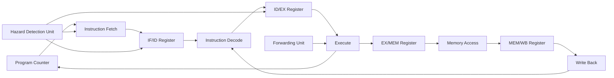

# Architecture

This document gives a high-level overview of the architecture of the **RV32I Pipelined RISC-V Processor**.

The processor is a 32-bit RISC-V processor based on a subset of the RV32I base integer instruction set.

---

## Design Goals

The main goal of this project is to implement a simple but complete pipelined RV32I processor suitable for learning processor architecture and RTL design.

The design focuses on:

* modular Verilog implementation
* 32-bit RV32I-style datapath
* separate instruction and data memories
* 5-stage pipelined execution
* clear separation of datapath and control logic
* support for forwarding, stalls, and flushes
* program-level verification using `.mem` files and testbenches

The processor is designed mainly for simulation and learning. It is not intended to be a complete production-ready RV32I core.

---

## High-Level Processor View

The processor contains the following major blocks:



At a high level:

```text
Instruction Fetch -> Decode -> Execute -> Memory -> Write Back
```

Each stage performs one part of instruction execution. Pipeline registers are placed between stages so that multiple instructions can be processed at the same time.

---

## Architectural Style

The processor uses a simple Harvard-style memory organization.

```text
Instruction Memory -> used for instruction fetch
Data Memory        -> used for load/store data access
```

This keeps instruction fetch and data memory access separate, avoiding structural conflicts between the IF and MEM stages.

The design uses a single clock and reset. All main architectural state updates happen synchronously.

---

## Main Datapath Blocks

### Program Counter

The Program Counter stores the address of the current instruction.

During normal execution:

```text
PC_next = PC + 4
```

For control-flow instructions such as branches and jumps:

```text
PC_next = target_address
```

The PC can also be held during a stall.

---

### Instruction Memory

Instruction memory stores the program instructions.

The processor uses 32-bit instructions. Since the PC is byte-addressed and instruction memory is word-indexed, the memory is accessed using:

```verilog
memory[pc[31:2]]
```

So:

```text
PC = 0   -> instruction memory[0]
PC = 4   -> instruction memory[1]
PC = 8   -> instruction memory[2]
```

Programs are loaded into instruction memory using `.mem` files during simulation.

---

### Register File

The register file contains 32 registers, each 32 bits wide.

```text
x0  -> hardwired to 0
x1-x31 -> general-purpose registers
```

The register file has:

* two read ports
* one write port
* synchronous write
* reset support
* hardwired `x0` behavior

Writes to `x0` are ignored so that `x0` always remains zero.

---

### Immediate Generator

The immediate generator extracts immediate values from the instruction and sign-extends them to 32 bits.

It supports the immediate formats needed by the implemented instruction subset:

```text
I-type
S-type
B-type
J-type
```

The generated immediate is used for ALU immediate operations, load/store address calculation, branch target calculation, and jump target calculation.

Detailed immediate encoding is covered in [`instruction_set.md`](instruction_set.md).

---

### Control Unit

The control unit decodes the opcode of the instruction and generates the main control signals required by the datapath.

Important control signals include:

| Signal     | Purpose                                        |
| ---------- | ---------------------------------------------- |
| `RegWrite` | Enables register file write                    |
| `ALUSrc`   | Selects register or immediate as ALU operand B |
| `MemRead`  | Enables data memory read                       |
| `MemWrite` | Enables data memory write                      |
| `MemToReg` | Selects memory data for write-back             |
| `Branch`   | Indicates branch instruction                   |
| `Jump`     | Indicates jump instruction                     |
| `ALUOp`    | Helps select the ALU operation                 |

These control signals move through the pipeline along with the instruction.

---

### ALU Control

The ALU control unit decides the exact ALU operation using:

```text
ALUOp
funct3
funct7
```

The main control unit gives a broad operation category, and the ALU control unit converts it into the exact ALU operation.

---

### ALU

The ALU performs arithmetic and logical operations.

It is used for:

* arithmetic operations
* logical operations
* load/store address calculation
* branch comparison support
* set-less-than operation

The ALU result is passed to later stages through the pipeline registers.

---

### Data Memory

Data memory is used by load and store instructions.

For load instructions:

```text
register <- data_memory[address]
```

For store instructions:

```text
data_memory[address] <- register_data
```

The address is calculated by the ALU.

```text
address = base_register + immediate
```

Like instruction memory, data memory is accessed using word indexing:

```verilog
memory[addr[31:2]]
```

---

### Write-Back Mux

The write-back stage selects the final value to be written into the register file.

Possible write-back sources are:

| Source             | Used By           |
| ------------------ | ----------------- |
| ALU result         | ALU instructions  |
| Data memory output | Load instructions |
| PC + 4             | Jump instruction  |

The selected value is written to the destination register when `RegWrite` is enabled.

---

## Pipeline Organization

The processor uses a 5-stage pipeline.

| Stage | Name               | Main Role                                                                  |
| ----- | ------------------ | -------------------------------------------------------------------------- |
| IF    | Instruction Fetch  | Fetch instruction and calculate `PC + 4`                                   |
| ID    | Instruction Decode | Decode instruction, read registers, generate immediate and control signals |
| EX    | Execute            | Perform ALU operation and branch/jump target calculation                   |
| MEM   | Memory Access      | Read/write data memory                                                     |
| WB    | Write Back         | Write final result to register file                                        |

The stages are separated using four pipeline registers:

| Pipeline Register | Location           |
| ----------------- | ------------------ |
| `if_id`           | Between IF and ID  |
| `id_ex`           | Between ID and EX  |
| `ex_mem`          | Between EX and MEM |
| `mem_wb`          | Between MEM and WB |

The detailed stage-by-stage design is documented in [`pipeline_design.md`](pipeline_design.md).

---

## Control Flow

The processor normally executes instructions sequentially.

```text
PC -> PC + 4
```

For branch and jump instructions, the EX stage determines whether the next PC should change.

```text
PC -> branch/jump target
```

When a branch or jump changes the PC, younger wrong-path instructions are flushed from the pipeline.

Detailed branch and jump handling is documented in [`hazards.md`](hazards.md).

---

## Hazard Support

Because the processor is pipelined, hazards can occur when instructions depend on each other.

The design includes support for:

* data forwarding
* load-use hazard stall
* branch and jump flush
* write-back to decode bypass

These mechanisms allow the processor to correctly execute dependent instructions without requiring manual NOP insertion in most cases.

Detailed hazard logic is documented in [`hazards.md`](hazards.md).

---

## RTL Organization

The RTL is organized to keep the core reusable blocks, pipeline stages, pipeline registers, and hazard logic separate.

A simplified organization is:

```text
rtl/
├── core/
│   ├── alu.v
│   ├── alu_control.v
│   ├── control_unit.v
│   ├── data_memory.v
│   ├── immediate_generator.v
│   ├── instruction_memory.v
│   ├── mux2_32.v
│   ├── adder.v
│   ├── program_counter.v
│   └── register_file.v
│
└── pipeline/
    ├── pipelined_top.v
    ├── stages/
    │   ├── if_stage.v
    │   ├── id_stage.v
    │   ├── ex_stage.v
    │   ├── mem_stage.v
    │   └── wb_stage.v
    │
    ├── registers/
    │   ├── if_id.v
    │   ├── id_ex.v
    │   ├── ex_mem.v
    │   └── mem_wb.v
    │
    └── hazard/
        ├── forwarding_unit.v
        └── hazard_detection_unit.v
```

This modular structure makes the processor easier to debug, extend, and verify.

---

## Implemented Scope

The current architecture supports:

* 32-bit datapath
* 32 general-purpose registers
* hardwired `x0`
* instruction fetch and PC update
* immediate generation
* main control unit
* ALU control
* ALU operations
* load/store data memory access
* 5-stage pipelined datapath
* pipeline registers
* forwarding
* load-use stall
* branch/jump flush
* program-level simulation using `.mem` files

---

## Out of Scope

The following features are not implemented in this version:

* complete RV32I instruction set
* CSR instructions
* exceptions and interrupts
* byte and halfword load/store instructions
* caches
* branch prediction
* out-of-order execution
* virtual memory
* FPGA-specific or ASIC-specific optimization

These can be considered possible future extensions.

---

## Summary

The processor is a modular 5-stage pipelined RV32I processor designed for learning and demonstrating processor architecture concepts.

The architecture includes the essential components of a simple RISC processor:

```text
PC
Instruction Memory
Register File
Immediate Generator
Control Unit
ALU Control
ALU
Data Memory
Write-Back Logic
Pipeline Registers
Hazard Handling Units
```
