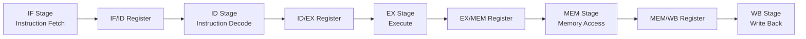

# Pipeline Design

This document explains the 5-stage pipeline structure used in the **RV32I Pipelined RISC-V Processor**.

The processor is organized into five stages:

```text
IF -> ID -> EX -> MEM -> WB
```

Each stage performs one part of instruction execution. Pipeline registers are placed between stages so that multiple instructions can be processed at the same time.


---

## 1. Pipeline Overview

The processor uses a classic 5-stage RISC pipeline.

| Stage | Name               | Main Function                                                              |
| ----- | ------------------ | -------------------------------------------------------------------------- |
| IF    | Instruction Fetch  | Fetch instruction from instruction memory                                  |
| ID    | Instruction Decode | Decode instruction, read registers, generate immediate and control signals |
| EX    | Execute            | Perform ALU operation and calculate branch/jump target                     |
| MEM   | Memory Access      | Read from or write to data memory                                          |
| WB    | Write Back         | Write final result back to register file                                   |

In an ideal pipeline, once the pipeline is filled, one instruction completes every clock cycle.

---

## 2. Pipeline Flow



The instruction moves through the processor as:

```text
Instruction Fetch
Instruction Decode
Execute
Memory Access
Write Back
```

---

## 3. Pipeline Timing

For a single instruction:

| Cycle | Stage |
| ----- | ----- |
| 1     | IF    |
| 2     | ID    |
| 3     | EX    |
| 4     | MEM   |
| 5     | WB    |

For multiple instructions, the stages overlap.

| Cycle | Instruction 1 | Instruction 2 | Instruction 3 | Instruction 4 |
| ----- | ------------- | ------------- | ------------- | ------------- |
| 1     | IF            | -             | -             | -             |
| 2     | ID            | IF            | -             | -             |
| 3     | EX            | ID            | IF            | -             |
| 4     | MEM           | EX            | ID            | IF            |
| 5     | WB            | MEM           | EX            | ID            |
| 6     | -             | WB            | MEM           | EX            |
| 7     | -             | -             | WB            | MEM           |
| 8     | -             | -             | -             | WB            |

This overlapping execution improves instruction throughput compared to a single-cycle processor.

---

## 4. Why Pipeline Registers Are Needed

In a pipelined processor, different instructions are present in different stages at the same time.

Pipeline registers store the output of one stage and pass it to the next stage in the next clock cycle.

Without pipeline registers, signals from different instructions would mix together.

This design uses four pipeline registers:

| Pipeline Register | Between Stages |
| ----------------- | -------------- |
| `if_id`           | IF and ID      |
| `id_ex`           | ID and EX      |
| `ex_mem`          | EX and MEM     |
| `mem_wb`          | MEM and WB     |

---

## 5. IF Stage: Instruction Fetch

The IF stage fetches the instruction from instruction memory.

### Main Operations

```text
instruction = instruction_memory[PC]
pc_plus4    = PC + 4
```

The program counter normally moves to the next instruction:

```text
PC_next = PC + 4
```

For branch and jump instructions, the PC can be redirected to a target address. The actual flush behavior is explained in [`hazards.md`](hazards.md).

### Main Inputs

| Signal      | Purpose                        |
| ----------- | ------------------------------ |
| `clk`       | Clock                          |
| `rst`       | Reset                          |
| `stall`     | Holds PC when required         |
| `pc_src`    | Selects normal PC or target PC |
| `pc_target` | Branch/jump target address     |

### Main Outputs

| Signal     | Purpose                                |
| ---------- | -------------------------------------- |
| `pc`       | Current program counter                |
| `pc_plus4` | Address of next sequential instruction |
| `inst`     | Fetched instruction                    |

---

## 6. IF/ID Pipeline Register

The IF/ID register stores values generated by the IF stage.

### Stored Signals

| Signal     | Purpose                   |
| ---------- | ------------------------- |
| `pc`       | PC of fetched instruction |
| `pc_plus4` | PC + 4 value              |
| `inst`     | Fetched instruction       |

These values are used by the ID stage in the next cycle.

### Control Support

The IF/ID register can be:

| Action  | Purpose             |
| ------- | ------------------- |
| Held    | Used during a stall |
| Cleared | Used during a flush |

The detailed conditions for stall and flush are covered in [`hazards.md`](hazards.md).

---

## 7. ID Stage: Instruction Decode

The ID stage decodes the instruction and reads the register file.

### Main Operations

```text
decode instruction
read rs1 and rs2
generate immediate
generate control signals
```

The instruction fields are extracted as:

```text
opcode = inst[6:0]
rd     = inst[11:7]
funct3 = inst[14:12]
rs1    = inst[19:15]
rs2    = inst[24:20]
funct7 = inst[31:25]
```

### Main Inputs

| Signal          | Purpose                             |
| --------------- | ----------------------------------- |
| `inst`          | Instruction from IF/ID              |
| `pc`            | PC from IF/ID                       |
| `pc_plus4`      | PC + 4 from IF/ID                   |
| `wb_RegWrite`   | Register write enable from WB stage |
| `wb_rd`         | Destination register from WB stage  |
| `wb_write_data` | Write-back data from WB stage       |

### Main Outputs

| Signal          | Purpose                          |
| --------------- | -------------------------------- |
| `read_data1`    | Data read from `rs1`             |
| `read_data2`    | Data read from `rs2`             |
| `imm`           | Sign-extended immediate          |
| `rs1`           | Source register 1                |
| `rs2`           | Source register 2                |
| `rd`            | Destination register             |
| `funct3`        | Function field                   |
| `funct7`        | Function field                   |
| Control signals | Signals required by later stages |

---

## 8. ID/EX Pipeline Register

The ID/EX register stores decoded instruction information for the EX stage.

### Stored Datapath Signals

| Signal       | Purpose                                 |
| ------------ | --------------------------------------- |
| `pc`         | Used for branch/jump target calculation |
| `pc_plus4`   | Used for `jal` write-back               |
| `read_data1` | First register operand                  |
| `read_data2` | Second register operand / store data    |
| `imm`        | Immediate value                         |
| `rs1`        | Source register 1                       |
| `rs2`        | Source register 2                       |
| `rd`         | Destination register                    |
| `funct3`     | ALU/branch operation decode             |
| `funct7`     | ALU operation decode                    |

### Stored Control Signals

| Signal     | Used In |
| ---------- | ------- |
| `RegWrite` | WB      |
| `ALUSrc`   | EX      |
| `MemRead`  | MEM     |
| `MemWrite` | MEM     |
| `MemToReg` | WB      |
| `Branch`   | EX      |
| `Jump`     | EX/WB   |
| `ALUOp`    | EX      |

The control signals are generated in ID and carried forward with the instruction.

---

## 9. EX Stage: Execute

The EX stage performs ALU operations and target address calculation.

### Main Operations

```text
select ALU operands
perform ALU operation
calculate branch/jump target
evaluate branch condition
```

For R-type instructions:

```text
alu_result = read_data1 operation read_data2
```

For I-type ALU instructions:

```text
alu_result = read_data1 operation immediate
```

For load/store instructions:

```text
alu_result = base_register + immediate
```

For branch and jump instructions:

```text
pc_target = pc + immediate
```

### Main Inputs

| Signal       | Purpose                            |
| ------------ | ---------------------------------- |
| `pc`         | Used for target calculation        |
| `read_data1` | First ALU operand                  |
| `read_data2` | Second register operand            |
| `imm`        | Immediate value                    |
| `funct3`     | Operation selection                |
| `funct7`     | Operation selection                |
| `ALUSrc`     | Selects register/immediate operand |
| `Branch`     | Indicates branch instruction       |
| `Jump`       | Indicates jump instruction         |
| `ALUOp`      | ALU operation category             |

### Main Outputs

| Signal       | Purpose                  |
| ------------ | ------------------------ |
| `alu_result` | ALU output               |
| `write_data` | Store data passed to MEM |
| `pc_target`  | Branch/jump target       |
| `pc_src`     | PC redirect signal       |

---

## 10. EX/MEM Pipeline Register

The EX/MEM register stores the result of the EX stage for use in the MEM stage.

### Stored Datapath Signals

| Signal       | Purpose                      |
| ------------ | ---------------------------- |
| `alu_result` | ALU result or memory address |
| `write_data` | Store data for `sw`          |
| `pc_plus4`   | Return address for `jal`     |
| `rd`         | Destination register         |

### Stored Control Signals

| Signal     | Used In |
| ---------- | ------- |
| `RegWrite` | WB      |
| `MemRead`  | MEM     |
| `MemWrite` | MEM     |
| `MemToReg` | WB      |
| `Jump`     | WB      |

---

## 11. MEM Stage: Memory Access

The MEM stage performs data memory access.

### Load Operation

For `lw`:

```text
mem_read_data = data_memory[alu_result]
```

The loaded data is passed to the MEM/WB register and written back in the WB stage.

### Store Operation

For `sw`:

```text
data_memory[alu_result] = write_data
```

The store instruction does not write back to the register file.

### Non-Memory Instructions

For ALU and jump instructions, the MEM stage mainly passes values forward to the MEM/WB register.

### Main Inputs

| Signal       | Purpose                      |
| ------------ | ---------------------------- |
| `clk`        | Clock                        |
| `MemRead`    | Enables memory read          |
| `MemWrite`   | Enables memory write         |
| `alu_result` | Memory address or ALU result |
| `write_data` | Store data                   |

### Main Output

| Signal          | Purpose               |
| --------------- | --------------------- |
| `mem_read_data` | Data read from memory |

---

## 12. MEM/WB Pipeline Register

The MEM/WB register stores the values needed by the WB stage.

### Stored Datapath Signals

| Signal          | Purpose                  |
| --------------- | ------------------------ |
| `alu_result`    | ALU result               |
| `mem_read_data` | Data loaded from memory  |
| `pc_plus4`      | Return address for `jal` |
| `rd`            | Destination register     |

### Stored Control Signals

| Signal     | Used In                |
| ---------- | ---------------------- |
| `RegWrite` | Enables register write |
| `MemToReg` | Selects memory data    |
| `Jump`     | Selects `PC + 4`       |

---

## 13. WB Stage: Write Back

The WB stage selects the final result and sends it back to the register file.

### Write-Back Sources

| Source           | Used By          |
| ---------------- | ---------------- |
| ALU result       | ALU instructions |
| Memory read data | `lw`             |
| `PC + 4`         | `jal`            |

### Write-Back Selection

```text
if Jump:
    wb_write_data = pc_plus4
else if MemToReg:
    wb_write_data = mem_read_data
else:
    wb_write_data = alu_result
```

The selected value is written to register `rd` when `RegWrite` is enabled.

---

## 14. Control Signal Movement

Control signals are generated in the ID stage and move through the pipeline with the instruction.

```text
ID -> ID/EX -> EX/MEM -> MEM/WB -> WB
```

This is necessary because multiple instructions are active in the pipeline at the same time.

| Control Signal | Required Stage |
| -------------- | -------------- |
| `ALUSrc`       | EX             |
| `ALUOp`        | EX             |
| `Branch`       | EX             |
| `Jump`         | EX/WB          |
| `MemRead`      | MEM            |
| `MemWrite`     | MEM            |
| `MemToReg`     | WB             |
| `RegWrite`     | WB             |

---

## 15. Example Instruction Flow

For the instruction:

```asm
add x3, x1, x2
```

The pipeline flow is:

| Stage | Operation                              |
| ----- | -------------------------------------- |
| IF    | Fetch `add x3, x1, x2`                 |
| ID    | Decode instruction and read `x1`, `x2` |
| EX    | Add the two register values            |
| MEM   | No memory operation                    |
| WB    | Write result to `x3`                   |

For a load instruction:

```asm
lw x3, 0(x1)
```

The pipeline flow is:

| Stage | Operation                          |
| ----- | ---------------------------------- |
| IF    | Fetch instruction                  |
| ID    | Decode and read base register `x1` |
| EX    | Calculate memory address           |
| MEM   | Read data memory                   |
| WB    | Write loaded data to `x3`          |

For a store instruction:

```asm
sw x3, 0(x1)
```

The pipeline flow is:

| Stage | Operation                  |
| ----- | -------------------------- |
| IF    | Fetch instruction          |
| ID    | Decode and read `x1`, `x3` |
| EX    | Calculate memory address   |
| MEM   | Write `x3` data to memory  |
| WB    | No register write          |

---

## 16. Top-Level Pipeline Integration

The `pipelined_top.v` module connects:

```text
IF stage
IF/ID register
ID stage
ID/EX register
EX stage
EX/MEM register
MEM stage
MEM/WB register
WB stage
```

It also connects the required control and datapath signals between stages.

Hazard detection and forwarding units are connected in the top module, but their internal logic is documented in [`hazards.md`](hazards.md).

---

## 17. Design Summary

The final pipeline structure is:

```text
IF -> IF/ID -> ID -> ID/EX -> EX -> EX/MEM -> MEM -> MEM/WB -> WB
```

Each stage performs a small part of instruction execution, while pipeline registers preserve the correct values between stages.
